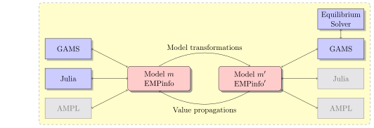

# ReSHOP

This package enables the use of the ReSHOP reformulation solver for JuMP models.
ReSHOP stands for **Re**formulation **S**olver for **H**ierrachical **O**ptimization **P**roblems.

It is mostly a reformulation engine, that it performs model transformations to bring a model into a form amenable to computation.
This includes models with Optimal Value functions, bilevel, MPEC, and Equilibrium (Nash Games) problems.
This class of mathematical programs falls into the [Extended Mathematical Programming](https://en.wikipedia.org/wiki/Extended_Mathematical_Programming)
umbrella. See also this [GAMS documentation page](https://www.gams.com/latest/docs/UG_EMP.html), and the [EMP.jl](https://github.com/xhub/EMP.jl) Julia package,
as presented in this [video presentation](https://www.youtube.com/watch?v=u7vASGAJYlY) from the JuMP-dev 2018 workshop.

One side-effect of implementing those model transformations is that ReSHOP has a full-fledged model representation.
This implies that it is capable of acting as a full MOI backend, with direct model capabilities.
The design is illustrated as follows:

The shaded blocks are the functionalities on the roadmap or work in progress.

## Installing

This package requires a valid GAMS install, with the `gams` executable in the system path,
that is the `gams` command be executed in a shell or `cmd.exe` session.
The user can refer to the GAMS installation instructions.

## Usage

As of now, there are the following options:
- the GAMS solver is specified via the `solver` keyword.

The function `ReSHOP.setsolverlog` switches the display of the GAMS solver log on the standard output.

This solver can be used in the *direct model* way. It is mostly done, some functions are not implemented, but those are mostly for display purposes.
Testing is unfortunately not as easy with this kind of solver.

Option passing to GAMS (for solver.opt files) is a work in progress.

## Updating

### Updating ReSHOP.jl

The package depends on the libreshop library binary. A JLL package for Julia 1.3 and above is in the works.
For now, the libreshop does not get updated with the julia files. After the update, the command `] build ReSHOP`
needs to be run to also update the library.

### Updating GAMS

ReSHOP needs to bootstrap GAMS via a file. The latter is automatically generated the first time the solver is run.
If the GAMS distribution/license is changed, one needs to run `ReSHOP.reshop_init_gams_solverdata(true)` to update
the GAMS bootstrap file.

## Limitations

- Some GAMS solver seem to misbehave during test, but not when used in some simple cases.
This may be due to some global variable or other kind of memory issue.
Please report such bugs.

## Acknowledgements
The MBP codepath package is heavily based on AmplNLWriter.jl
